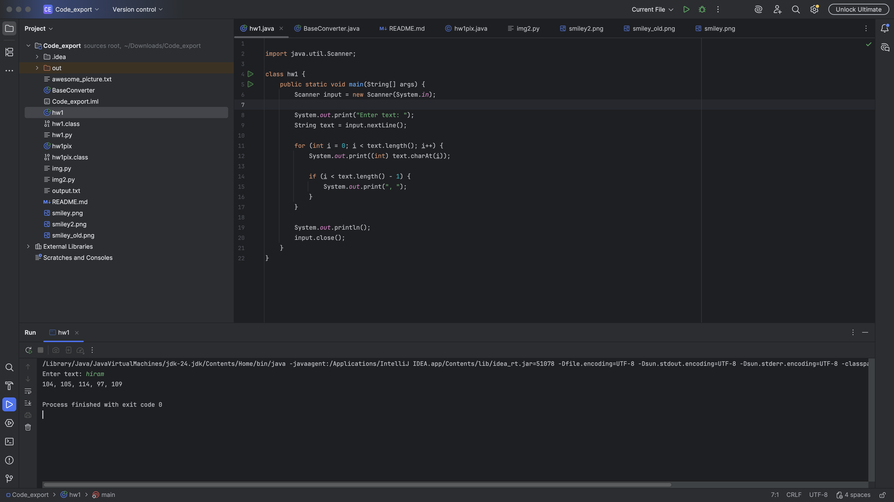
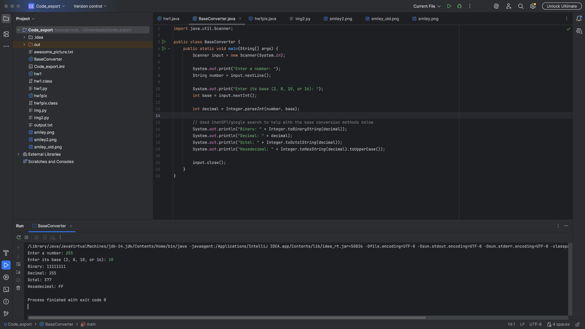
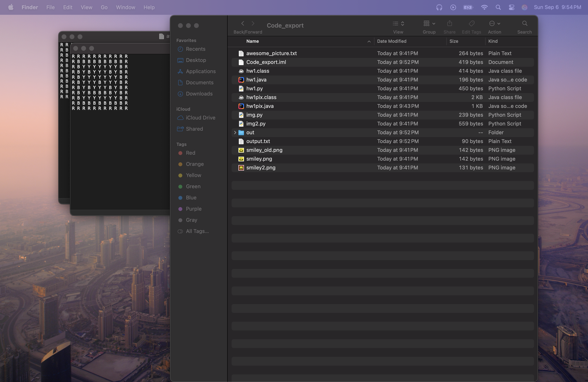
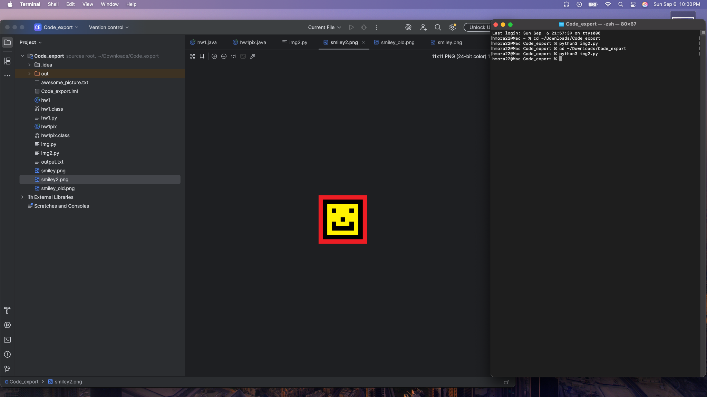

# CS 240 Computer Organization

## The Repository

This repository contains Assignment 1 for CS 240 Computer Organization.

## Converter and Pixel System

This project contains an ASCII converter, number base converter, image reader, and image creator.

### ASCII Converter

The ASCII converter asks the user to enter text. It prints the decimal ASCII value of each character.

### Number Base Converter

The number base converter accepts a number in binary, decimal, octal, or hexadecimal. It displays the number in all four bases.

### Image Reader

This program reads smiley.png and saves its pixel values in output.txt.

### Image Creator

This program reads the pixel values in awesome_picture.txt and creates smiley2.png.

## Program Screenshots

### hw1.java ASCII Converter

### BaseConverter.java Number Base Converter

### hw1pix.java Image Reader

### img2.py Image Creator

## Input and Generated Images

### smiley.png Input Image

### smiley2.png Generated Image

